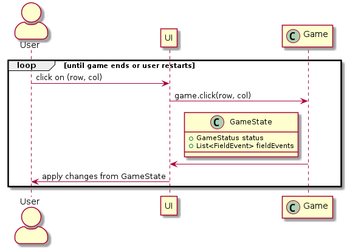
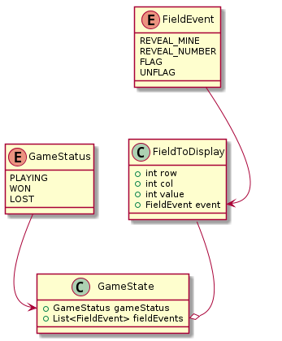

<p>
    <a href="https://github.com/MagdaCzapiewska"><strong>Magdalena Czapiewska</strong></a>
    ·
    <a href="https://github.com/jk438520"><strong>Jakub Kłos</strong></a>
    ·
    <a href="https://github.com/Klosiu889"><strong>Jakub Kołaczyński</strong></a>
    ·
    <a href="https://github.com/wojtek-rz"><strong>Wojciech Rzepliński</strong></a>
</p>

# Android minesweeper game

[](https://github.com/jk438520/team777-minesweeper/actions/workflows/android.yml)
[](https://github.com/jk438520/team777-minesweeper/actions/workflows/test.yml)
[](https://codecov.io/gh/jk438520/team777-minesweeper)
[](https://github.com/jk438520/team777-minesweeper/actions/workflows/lint.yml)


## Gradle commands

### Build

You can build project from command line using:
```
./gradlew build
```
To create apk use:
```
./gradlew assemble
```
For more info check [Android Studio website](https://developer.android.com/build/building-cmdline):

### Tests

You can run tests from command line using:
```
./gradlew test
```
Or you can do it manually by clicking in Android Studio by doing right-click on a directory or file with test and click ___Run___

For connected tests (run on android emulator) you can use:
```
./gradlew connectedAndroidTest
```

### Lint check

You can run code inspections from command line using:
```
./gradlew lint
```
Or you can do it manually by clicking in Android Studio: ___Code > Inspect Code___.

For more information check [lint guidelines](https://developer.android.com/studio/write/lint.html).

## User - UI - Engine interface

Interaction between UI and game engine is done using 2 methods:

```
GameState Game.click(int row, int column);
void Game.setClickMode(ClickMode clickMode);
```

`Game.click(int row, int column)` returns `GameState` object that contains information about state of the game (`PLAYING`, `WON`, `LOST`) and collection of fields and values to which those fields have to change after a click was registered.

`Game.setClickMode(ClickMode clickMode)` doesn't return anything as it's assumed it has been succesfull.

#### Interaction with fields



#### GameState class



#### Interaction with flag toggle

